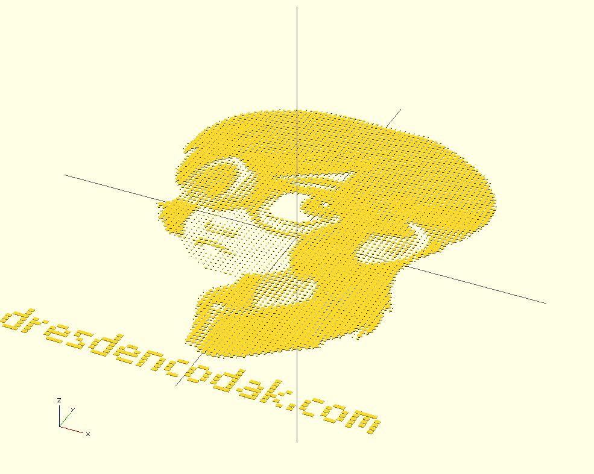

##OpenSCAD Writer##

Write Text with pixel based fonts in OpenSCAD.

###Usage###
####Importing####
```
use </path/to/writer.scad>;
import </path/to/font_file.scad>;
```

####Syntax####
```
write( text, font, size=[10,10,1] , center=false , pixel_signifier = "1" , fallback_char = "?" );
```

```
write( text, font, size=[10,10,1] , center=false , pixel_signifier = "1" , fallback_char = "?" )
	child();
```

#####write() Arguments#####
- `text`: String or Vector containing the caracters as single elements. Use vector if your text contains multibyte characters.
- `font`: The font vector. Should match the vector specified in yout font file.
- `size`: Size vector. Specifies width and height of the pixel matrix to use. Will also be used 
- `center`: Boolean. Center the text object.
- `pixel_signifier`: Which character in your font definition is marking a pixel.
- `fallback_char`: Which character to display, if the actual char is not found in font definition

###Examples###
####General usage####
```
// import writer
use <writer.scad>;
// import font
include <fonts/default_font.scad>;

write("Hello World",default_font);
```


####Write with child objects####
```
use <../writer.scad>;
include <../fonts/default_font.scad>;

write("Some Text",default_font,center=true)
	cylinder(r=6,h=2);
```


####Sizing####
```
use <../writer.scad>;
include <../fonts/default_font.scad>;

write("All of your base",default_font,size=[3,6,1],center=true);

translate([0,-40,0])
	write("are belong to us.",default_font,size=[6,3,1],center=true)
		cube([6,2,1]);
```


####Multibyte Characters####
```
use <../writer.scad>;
include <../fonts/default_font.scad>;

unicode_text = ["›","U","n","i","c","o","d","e","™","‹"];

write( unicode_text , default_font , center=true );
```


####Playing around with pixel sigifiers####
Make a printing plate out of some ASCII-Art.

```
use <../writer.scad>;
include <../fonts/kim.scad>;
include <../fonts/default_font.scad>;


for( pix=[[".",1],["-",2],["+",3],["=",4],["E",5],["#",6]] )
	write("?",kim,center=true,size=[7,7,1],pixel_signifier=pix[0])
		cylinder(r=pix[1],h=1,$fn=4);

translate([0,-310,0])
	write("dresdencodak.com",default_font,size=[7,7,1],center=true)
		cube([7,5,1]);
```


Note: There is some ASCII-Art in /fonts/kim.scad.


###Defining Fonts###
A font is just a vector containing all glyphs. 
As a best practice you should only specify one font per file and name the variable after the file's name.
So, assuming your font's name is "foobar" you should create a file named `fonts/foobar.scad` and name the variale as well `foobar`.

Okay ... less talking, more example:
```
// File `fonts/myfont.scad`:
myfont = [
	[ "A",
		[
		"     ",
		" 11  ",
		"1  1 ",
		"1111 ",
		"1  1 ",
		"     ",
		],
	],
	[ "B",
		[
		"111  ",
		"1  1 ",
		"111  ",
		"1  1 ",
		"111  ",
		"     ",
		],
	],
	// and so on ... many many letters.
];
// EOF myfont.scad
```
